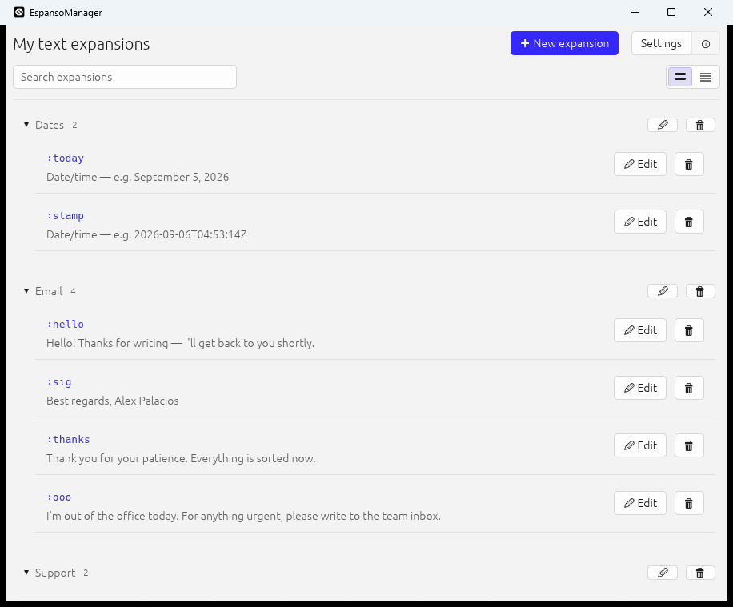
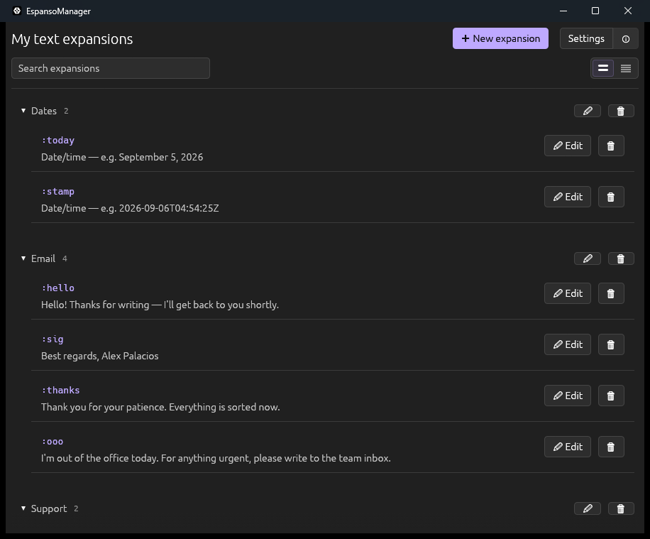

<div align="center">

# ⌨️ EspansoManager

**A small desktop window for your [espanso](https://espanso.org) text expansions.**


**Free forever. No account, nothing sent anywhere.**

</div>

<table>
<tr>
<td width="50%"></td>
<td width="50%"></td>
</tr>
<tr>
<td align="center"><sub>☀️ Light</sub></td>
<td align="center"><sub>🌙 Dark</sub></td>
</tr>
</table>

---

## ✨ What it does

You type `:sig`, and your whole signature appears. You type `:today`, and today's date
appears. That is espanso, and it works everywhere you type — email, chat, a document, the
browser.

The only awkward part is setting those up: normally it means opening a configuration file
and editing it by hand. EspansoManager is the window that does that for you. You write the
short thing, you write the long thing, and it is ready.

> 💡 Nothing is hidden away, though. It writes espanso's own `.espanso/match/base.yml`, so
> the file stays perfectly readable and you can still edit it by hand whenever you want to.

---

## 🎈 A few things it can do

|  |  |
|---|---|
| ✏️ | Create and edit expansions without ever opening a file. |
| 📁 | Keep them tidy in folders. |
| ⏸️ | Pause for ten minutes when they are in the way — or until you say otherwise. |
| 🎨 | Light and dark themes, or follow Windows, accent colour and all. |
| 📅 | Insert today's date in the format you like, without learning any syntax. |
| 🔔 | Live quietly in the tray, and start with Windows if you want it to. |
| 📤 | Export your expansions and send them to a colleague. |
| 🌍 | Speak English, Spanish, Filipino or Hindi. |
| 💾 | Keep a backup of every save, in case you change your mind. |

There is more than this in there. It is meant to be found by using it.

---

## 🔒 Free, and yours

|  |  |
|---|---|
| 💚 | **Free forever.** No price, no trial, no paid version waiting further down the road. |
| 🔌 | **No internet.** There is no networking code in it at all — nothing in `Cargo.toml` is even capable of opening a connection. |
| 🏠 | **Your text never leaves your computer.** No account, no sync, no telemetry, no analytics. Your expansions are a plain file on your own disk, and that is the only place they are. |

---

## 🙏 Credits

None of this would exist without two things:

- 🧠 **[espanso](https://espanso.org)** and the extraordinary work of its developer,
  [Federico Terzi](https://federicoterzi.com). espanso does all the real work — the
  keyboard hooks, the matching, the text injection. This app only gives it a window.
- 🤖 **[Claude Code](https://claude.com/claude-code)**, which wrote this program.

> ⚠️ The author, **Alex Palacios**, has **no programming knowledge whatsoever**. Every line
> here was written by Claude Code, at his direction and against his testing: he decided what
> the app should do, used it every day, and said what was wrong until it was right. He cannot
> review this code, and does not claim to.
>
> That is worth stating plainly rather than leaving to be discovered. If you are considering
> running this, read it, or build it yourself from source — do not take its correctness on
> anyone's word here.

---

## 🚫 What this is not

This is **not a fork of espanso** and contains none of its code. EspansoManager is a
separate program that talks to espanso from the outside, by launching `espansod.exe` as a
child process and reading what it prints (`src/espanso_ctl.rs`). The two are shipped in the
same folder; they are not the same work. Sharing espanso's GPL-3.0 licence is a choice made out
of respect for it, not something the code required.

---

## 📦 Repository scope

This repository is the **source only** — under 1 MB. It deliberately does not contain:

| Not here | Why |
|---|---|
| 🏗️ `EspansoManager.exe`, the distribution ZIP | Build outputs. GitHub Releases is the place for these, when there is something to release. |
| 🧩 `espansod.exe`, `msvcp140*.dll`, … | Not our code. |
| 🔒 `.espanso/`, `.espanso-manager/`, `.espanso-runtime/` | The user's real expansions and settings. |
| 🗑️ `target/` | 1.3 GB build cache; regenerates in ~3 minutes. |

All of those live one level above this folder in a working copy, outside the repository —
see the note in `.gitignore` for why the root is drawn here and not higher.

> 🔏 The screenshots above were taken from a throwaway copy holding invented expansions,
> never from a real one.

---

## 🔨 Building

Requires a stable Rust toolchain (built with 1.98, edition 2021) on Windows.

```sh
cargo build --release
```

The binary lands at `target/release/EspansoManager.exe` and is meant to be copied one level
up, next to `espansod.exe`.

```sh
cargo test                            # 49 tests
cargo clippy --release --all-targets
```

Both are expected to be clean. `profile.release` uses `panic = "abort"`; the panic hook in
`main.rs` still runs and still shows its dialog, which is verified on the built binary — see
the comment in `Cargo.toml` before changing it.

---

## 🗺️ Finding your way around

**Every file in `src/` opens with a `//!` header** stating what that file decides, what
invariant it holds, and what does not belong in it. Read that header before editing the
file — it is the real documentation, and it is kept true.

| File | What it owns |
|---|---|
| `main.rs` | Startup order. |
| `app.rs` | All state, and every write to disk. |
| `yaml/` | The shape of `base.yml`, and the promise that anything the interface cannot display is preserved untouched. |
| `espanso_ctl.rs` | Everything said to the daemon — all of it blocking, all of it on a deadline. |
| `ui/` | The screens. Nothing here ever touches the disk. |

---

## 📌 Status

In daily use by the author. Interface is finished and approved; changes that make it uglier
are not wanted. The Filipino and Hindi translations have not been reviewed by a native
speaker.

---

## 📄 License

EspansoManager was created by **Alex Palacios** and is licensed under the
[GPL-3.0 license](LICENSE) — the same licence [espanso](https://espanso.org) uses, matched on
purpose rather than by obligation.

Use it, study it, change it, share it. If you pass on a changed version, it travels with its
source and the same licence, so whoever receives it keeps every freedom you had.
